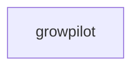

# Dependency Graph

```mermaid
graph TD
  growpilot[growpilot]

```

**Legend:**
- Solid arrows (`-->`) = declared dependencies in workspace manifest
- Dashed arrows (`-.->`) = detected from code analysis